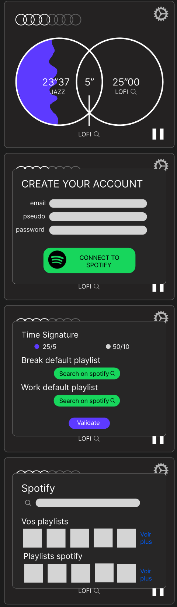

# foocus

Foocus is a cross-platform app based on the pomodoro method and spotify, the goal is to have this app on ios, android, desktop or web.
The goal is to plan work sessions ( 25 minutes of work and 5 minutes of pause) in order to be  productive.

## First low fidelity mockup

this low fidelity mockup has been used to test the ux of the ui.
## Process and goal
I aim to create a tool that will be free of use for everyone, and a tool that answers one of my needs as a developer.

## App architecture
This app will use the bloc pattern for state management. 
This will allow a lot of code reuse in later projects 